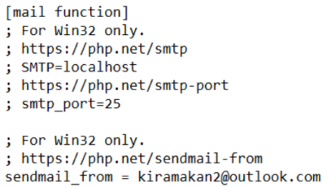

  

<h3 align="center">Final Year Project made by Cheah Shaoren & <a href="https://github.com/ShoYongQuan">Sho Yong Quan</a></h3>
<h5>Diploma in Information Technology @ Sunway College Kuala Lumpur</h5>

 

## Description

Group dining has always been accompanied by one issue: who is going to pay the bill in advance ? Whether the bill is paid separately or voluntarily paid for everyone first, it will still bring up an additional issue: how to split the tax. The payer is also obligated to request back the money from debtors afterwards, which may be awkward as requesting back money does affect one psychologically. Therefore, paying during group dining has always been a hassle. 

This project aims to resolve such inconvenience by developing an improvised food ordering application using HTML, CSS, JavaScript, PHP, Bootstrap 5, AJAX, JSON, and MySQL Server, that helps with bill calculation and improves daily restaurant operations by providing them with an affordable food ordering platform capable of running on low-end devices.

Check out the demo video for KiraMakan: https://youtu.be/gZPCSB2Z7dk

 

## Installation

Softwares required for this project: XAMPP, Apache and, MySQL

1. Install XAMPP and import the files into (`\xampp\htdocs`) in XAMPP folder
2. Open XAMPP control panel and click (`Admin`) to access the database
3. Create a new database called (`kiramakan`)
4. Import the SQL that can be found in (`\xampp\htdocs\KiraMakan\Misc`)

 

## Configuration

Enable PHP mailing feature

1. Update the SMTP port number and server from (`\xampp\sendmail\sendmail.ini`)
 
2. Update the send mail function from (`\xampp\php\php.ini`)
  
** Default sender email is (`kiramakan@outlook.com`) with the password of (`KMFYP202108`)

 

## Accessing

To access KiraMakan, you can create a new account or log in with a guest email (`guest@gmail.com`).
For restaurant emails, follow the format of (`<restaurant name>@gmail.com`).
All account has a password of (`12345678`).

